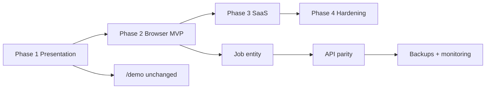

# Profit Pulse — Missing Feature Build Plan

**Date:** 2026-06-29  
**Source:** [`PROFITPULSE_PRODUCT_COMPLETENESS_AUDIT.md`](./PROFITPULSE_PRODUCT_COMPLETENESS_AUDIT.md)  
**Repo:** `contractorcomplianceco-cmyk/profitpulse` · `@workspace/healthcast`  
**Principle:** Phase 1 optimizes **Rose presentation trust** without claiming production SaaS. Phase 2 makes the **browser app coherent**. Phases 3–4 replace localStorage with **real infrastructure**.

**Risk levels:** `Low` | `Medium` | `High` | `Critical`

---

## How to read each item

| Field | Meaning |
|-------|---------|
| **What to build** | Concrete deliverable |
| **Why** | Rose / client need |
| **Files** | Primary touch points (not exhaustive) |
| **Acceptance** | Done when… |
| **Test** | Command or manual check |
| **Risk** | Delivery / product / security risk if skipped or done wrong |

**Standard test commands** (reuse across phases):

```bash
cd /home/ubuntu/projects/profitpulse
PORT=3010 BASE_PATH=/ pnpm --filter @workspace/healthcast run typecheck
PORT=3010 BASE_PATH=/ pnpm --filter @workspace/healthcast run build
pm2 restart profitpulse   # after deploy to demo host
curl -I https://demo.ccaprofitpulse.com/
curl -I https://demo.ccaprofitpulse.com/demo
```

---

# Phase 1 — Demo completeness / Rose presentation

**Goal:** Video demo stays **public and video-first**; logged-in workspace **feels intentional** when Rose clicks past `/demo`. No backend work. No pretending modules are production-ready.

**Duration estimate:** 1–2 weeks  
**Exit criteria:** Rose can watch `/demo`, sign in, and see a **consistent contractor financial story** on core pages without mock/chart contradictions or empty shell modules in default nav.

---

### P1-01 — Tag or hide “Preview” modules in default sidebar

| | |
|---|---|
| **What to build** | Badge **Preview** on nav items that are still `@/data/*` only (Copilot, Briefing, Marketing ROI, Reports, Futurecast, Market & Economy, Goals, Compliance, Dept Performance, Client Profitability until wired). Option: collapse into “More (Preview)” section for Rose review profile. |
| **Why** | Rose sees 31 links; empty shells read as “missing product.” Honest labeling restores trust. |
| **Files** | `src/components/layout/SidebarNav.tsx`, `src/brand/demoMode.ts` (optional `roseReviewNav` flag), `docs/PROFITPULSE_PRODUCT_COMPLETENESS_AUDIT.md` (cross-ref) |
| **Acceptance** | Default sidebar shows ≤15 primary modules without Preview badge; all Preview items labeled; no route 404s. |
| **Test** | Login `admin@demo.com` → sidebar audit matches audit doc mock list. |
| **Risk** | **Medium** — leaving shells visible continues “missing a lot” perception. |

---

### P1-02 — Contractor-aligned seed data pack

| | |
|---|---|
| **What to build** | Replace healthcare-compliance narrative in seed with **contractor operator** sample: jobs/projects language, construction/medical facility **clients**, margin on work orders, payroll as job cost. Keep schema; rename accounts/facilities → clients/sites or add job names in descriptions. |
| **Why** | Demo video says “jobs · projects · accounts”; workspace still shows “Sunrise Senior Living compliance retainer.” Story break undermines demo. |
| **Files** | `src/lib/profit-pulse/seed.ts`, optionally `src/demo/scenes/*` (copy alignment only), `docs/PROFITPULSE_DEMO_NARRATION.md` |
| **Acceptance** | Executive Overview KPIs, account names, and alert copy reference contractor jobs/margin; no “compliance retainer” as primary headline unless intentional. |
| **Test** | Fresh localStorage (`resetDemoData` in Settings) → seed matches contractor story; typecheck + build pass. |
| **Risk** | **Medium** — wrong vertical story is top Rose feedback driver per audit. |

---

### P1-03 — Wire Executive Overview to 100% live metrics

| | |
|---|---|
| **What to build** | Remove or replace `integrationsData` mock strip with status derived from Integrations page (CSV/JSON = “Manual import”, connectors = “Preview”). All KPIs, charts, alerts from `metrics` / `calculations.ts` / `alerts.ts`. |
| **Why** | Executive dashboard is the first screen after login; hybrid data looks broken. |
| **Files** | `src/pages/ExecutiveOverview.tsx`, `src/data/overviewData.ts` (delete usage or shrink), `src/lib/profit-pulse/calculations.ts` |
| **Acceptance** | Edit a revenue record → Executive revenue KPI and at least one chart update without refresh; no static numbers from `@/data/overviewData`. |
| **Test** | Manual: CRUD revenue → verify Overview; `pnpm --filter @workspace/healthcast run typecheck` |
| **Risk** | **High** — primary “command center” credibility. |

---

### P1-04 — Wire Revenue Intelligence charts from live records

| | |
|---|---|
| **What to build** | Replace `revenueTrendData`, `revenueByService`, `revenueByState` mocks with aggregations over `state.revenueRecords` + `state.accounts` (by month, category, state). Keep account CRUD. |
| **Why** | Rose expects “revenue tracking” to mean charts follow the table. |
| **Files** | `src/pages/RevenueIntelligence.tsx`, `src/lib/profit-pulse/calculations.ts` (new helpers: `revenueByMonth`, `revenueByCategory`, `revenueByState`), `src/data/revenueData.ts` |
| **Acceptance** | Add/delete revenue row → trend chart and breakdown bars change; KPI row matches `metrics.monthlyRevenue` or derived totals. |
| **Test** | typecheck + build; manual CRUD on `/revenue-intelligence` |
| **Risk** | **High** |

---

### P1-05 — Wire Cash Flow projection from live AR/AP + records

| | |
|---|---|
| **What to build** | Drive cash projection chart and “pinch dates” from `cashProjection90d`, invoices, payables, `organization.cashOnHand` — not `cashFlowData.ts` static series. |
| **Why** | Cash flow is core financial ops; mock projection contradicts live CRUD below. |
| **Files** | `src/pages/CashFlow.tsx`, `src/lib/profit-pulse/calculations.ts`, `src/data/cashFlowData.ts` |
| **Acceptance** | Change `cashOnHand` in Settings or add payable → projection chart shifts; upcoming bills list matches `state.payables`. |
| **Test** | Manual on `/cash-flow`; typecheck |
| **Risk** | **High** |

---

### P1-06 — Wire Profitability breakdowns from live data

| | |
|---|---|
| **What to build** | Margin-by-category from revenue/expense categories; low-margin clients from account roll-ups; remove static `profitabilityData` charts where live equivalent exists. |
| **Why** | “Profit/margin analysis” is explicit demo promise. |
| **Files** | `src/pages/Profitability.tsx`, `src/lib/profit-pulse/calculations.ts`, `src/data/profitabilityData.ts` |
| **Acceptance** | Top KPIs and bar charts reconcile; `LiveDataBanner` detail matches chart totals. |
| **Test** | build + manual margin check after expense add |
| **Risk** | **High** |

---

### P1-07 — Wire AR/AP KPI row + aging (complete hybrid)

| | |
|---|---|
| **What to build** | Replace `arApKpis`, static aging, `clientsAtRisk` with computed values from `metrics`, `arAgingBuckets`, overdue invoices. Keep invoice/payable CRUD. |
| **Why** | Collections story must match invoice table Rose sees. |
| **Files** | `src/pages/ArApCollections.tsx`, `src/lib/profit-pulse/calculations.ts`, `src/data/arApData.ts` |
| **Acceptance** | Mark invoice overdue → KPI and aging chart update; clients-at-risk list = accounts with overdue AR. |
| **Test** | Manual `/ar-ap-collections` |
| **Risk** | **Medium** |

---

### P1-08 — Wire Sales Pipeline funnel from opportunities

| | |
|---|---|
| **What to build** | Stage funnel, pipeline value, stale deals from `state.opportunities`; drop static `pipelineData` for primary visuals. |
| **Why** | Demo scene 4 “jobs · projects · accounts” maps to pipeline + future jobs module. |
| **Files** | `src/pages/SalesPipeline.tsx`, `src/lib/profit-pulse/calculations.ts`, `src/data/pipelineData.ts` |
| **Acceptance** | Move opportunity stage → funnel segment updates; total pipeline = sum of open opp values. |
| **Test** | Manual CRUD on opportunities |
| **Risk** | **Medium** |

---

### P1-09 — Wire Staffing & Payroll charts from staffing records

| | |
|---|---|
| **What to build** | Payroll trend and department cost from `state.staffing`; align with `metrics.payrollBurden`. |
| **Why** | Labor cost is central to contractor margin story. |
| **Files** | `src/pages/StaffingPayroll.tsx`, `src/lib/profit-pulse/calculations.ts`, `src/data/staffingData.ts` |
| **Acceptance** | Add staffing row → department chart and payroll KPI update. |
| **Risk** | **Medium** |

---

### P1-10 — Read-only Jobs panel (bridge to demo narrative)

| | |
|---|---|
| **What to build** | **No full Job entity yet** — add “Active jobs” section on Sales Pipeline or Executive Overview: derive rows from top opportunities + linked revenue/expense by account (name, value, margin %, status). Label “Derived from pipeline · full job tracking in Phase 2.” |
| **Why** | Closes gap between video demo “Job #1847” and app UI without backend. |
| **Files** | `src/pages/SalesPipeline.tsx` or `ExecutiveOverview.tsx`, `src/lib/profit-pulse/calculations.ts` (new `deriveJobSnapshots`) |
| **Acceptance** | At least 3 job-like rows with margin; copy references sample/derived data. |
| **Test** | Visual check after seed load |
| **Risk** | **Medium** — do not over-promise as ERP job costing. |

---

### P1-11 — Welcome + workspace demo banner

| | |
|---|---|
| **What to build** | Welcome page: one-click “Open demo workspace” (login hint), explain browser-local sample data. Persistent slim banner on gated routes: “Evaluation workspace · data stays in this browser.” |
| **Why** | Sets expectations; Rose won’t assume multi-user production. |
| **Files** | `src/pages/Welcome.tsx`, `src/components/profit-pulse/LiveDataBanner.tsx` or new `WorkspaceModeBanner.tsx`, `src/data/onboardingData.ts` |
| **Acceptance** | New visitor sees explanation before Overview; banner dismissible once per session. |
| **Test** | Incognito → login flow |
| **Risk** | **Low** |

---

### P1-12 — Keep `/demo` video-first (regression guard)

| | |
|---|---|
| **What to build** | Document + verify: `/demo` public, no AuthGate, no workspace providers, auto narration policy unchanged. Add smoke note in deploy checklist. |
| **Why** | Client-demo rule: video first, Enter Demo, no login on walkthrough. |
| **Files** | `src/App.tsx`, `src/demo/DemoWalkthrough.tsx`, `docs/PUBLIC-DEMO-ROUTE.md`, `docs/DEMO-AUDIO.md` |
| **Acceptance** | `curl -I …/demo` 200; `/#/demo` loads with no redirect to login; 7 scenes + audio policy intact. |
| **Test** | `curl -I https://demo.ccaprofitpulse.com/demo` && manual unauthenticated `/demo` |
| **Risk** | **Critical** — breaking public demo blocks sales. |

---

### P1-13 — Copilot / Briefing / Reports honest empty states

| | |
|---|---|
| **What to build** | Replace canned chat and fake PDF list with: “Preview — available after live data connection” + link to Scenario Builder and Alerts (live modules). |
| **Why** | Enterprise nav items that feel fake damage entire product credibility. |
| **Files** | `src/pages/CfoCopilot.tsx`, `src/pages/DailyBriefing.tsx`, `src/pages/Reports.tsx`, `src/data/copilotData.ts`, `src/data/briefingData.ts`, `src/data/reportsData.ts` |
| **Acceptance** | No fabricated AI answers or downloadable report filenames; Preview badge visible. |
| **Test** | Open each page logged in; no misleading CTAs. |
| **Risk** | **Medium** |

---

### P1-14 — Rose review navigation profile (optional flag)

| | |
|---|---|
| **What to build** | Env or query flag `?roseReview=1` / `VITE_ROSE_REVIEW=1`: sidebar shows Phase-1 core set only (Overview, Cash, Revenue, Profitability, AR/AP, Pipeline, Staffing, Alerts, Scenario, Integrations, Enter Demo). |
| **Why** | Controlled demo path for presentations without explaining 15 Preview modules. |
| **Files** | `src/components/layout/SidebarNav.tsx`, `src/brand/demoMode.ts`, `.env.example` |
| **Acceptance** | Flag on → trimmed nav; flag off → full nav with Preview badges. |
| **Test** | `/#/?roseReview=1` or build-time env |
| **Risk** | **Low** |

---

# Phase 2 — Browser MVP

**Goal:** Usable **single-browser** financial app: coherent CRUD, job/project entity, profitability dashboards, real exports — still localStorage, no Postgres requirement.

**Duration estimate:** 4–6 weeks  
**Exit criteria:** A prospect can run a month of contractor finances in one browser with jobs, clients, P&L views, CSV/Excel export, without mock chart layers.

---

### P2-01 — Job / Project entity + schema migration

| | |
|---|---|
| **What to build** | Add `Job` to `ProfitPulseState`: id, accountId, name, type (job/project/service), budget, status, start/end, optional facilityId. CRUD in provider; link revenue/expense optional `jobId`. localStorage version bump `version: 2` with migrator. |
| **Why** | Core missing entity per audit; contractor ICP requirement. |
| **Files** | `src/lib/profit-pulse/types.ts`, `storage.ts`, `seed.ts`, `context/ProfitPulseProvider.tsx`, `database/schema.sql` (forward-looking DDL) |
| **Acceptance** | Create job → assign revenue → job margin computable; migration preserves v1 tenants. |
| **Test** | typecheck; unit tests for migrator if added; manual CRUD |
| **Risk** | **High** — schema mistakes corrupt localStorage. |

---

### P2-02 — Jobs & Projects page + sidebar entry

| | |
|---|---|
| **What to build** | New route `/jobs` with table: name, client, budget, actual cost, margin %, status; filters; link to account and pipeline opp. |
| **Why** | Visible home for job profitability Rose asked for. |
| **Files** | `src/pages/JobsProjects.tsx` (new), `src/App.tsx`, `SidebarNav.tsx`, `billing/tiers.ts` (`ROUTE_FEATURE_MAP`) |
| **Acceptance** | CRUD jobs; margin updates when linked revenue/expense changes; nav entry under Operations. |
| **Test** | build; manual full flow |
| **Risk** | **Medium** |

---

### P2-03 — Client profitability from live accounts

| | |
|---|---|
| **What to build** | Rewire `ClientProfitability.tsx` to aggregate revenue, expenses, invoices by `accountId`; LTV and margin from calculations. |
| **Why** | Enterprise nav item currently 100% mock — high visibility gap. |
| **Files** | `src/pages/ClientProfitability.tsx`, `calculations.ts`, remove `clientsData.ts` dependency |
| **Acceptance** | Edit account revenue → client table row updates; no `@/data/clientsData` imports. |
| **Test** | typecheck + manual |
| **Risk** | **Medium** |

---

### P2-04 — Department performance from staffing + expenses

| | |
|---|---|
| **What to build** | Aggregate `staffing.department` + expense categories tagged to departments; cost vs revenue proxy. |
| **Why** | Operations leaders expect dept P&L view. |
| **Files** | `src/pages/DepartmentPerformance.tsx`, `calculations.ts`, `departmentsData.ts` |
| **Acceptance** | Department chart reflects staffing CRUD changes. |
| **Risk** | **Medium** |

---

### P2-05 — Complete hybrid page cleanup (remaining modules)

| | |
|---|---|
| **What to build** | Cash Calendar events from invoices/payables/payroll dates; Historical Trends from rolling monthly aggregates in state; Compliance from `state.risks`; Goals as simple targets stored in state (optional `goals[]`). |
| **Why** | Removes second layer of fiction across Planning/Governance. |
| **Files** | Respective `src/pages/*.tsx`, `calculations.ts`, reduce `src/data/*` |
| **Acceptance** | Audit appendix “Mock” count ≤ 3 pages (Marketing ROI, Market Economy, Copilot until Phase 4). |
| **Test** | grep `from "@/data/` in pages — trending down |
| **Risk** | **Medium** |

---

### P2-06 — Budget vs actual (job + org level)

| | |
|---|---|
| **What to build** | `budgetLines[]` on org and job; variance % on Jobs page and Executive Overview widget. |
| **Why** | Expected financial ops capability; missing entirely in audit. |
| **Files** | `types.ts`, `seed.ts`, `calculations.ts`, `JobsProjects.tsx`, `ExecutiveOverview.tsx` |
| **Acceptance** | Set job budget → actual from linked costs → variance displays. |
| **Risk** | **Medium** |

---

### P2-07 — Reports: CSV + Excel export (client-side)

| | |
|---|---|
| **What to build** | Reports page: generate P&L summary, AR aging, job margin report as **CSV download**; optional SheetJS for `.xlsx`. No fake “scheduled PDF.” |
| **Why** | “Reports & Exports” nav must do something real in browser MVP. |
| **Files** | `src/pages/Reports.tsx`, `src/lib/profit-pulse/export-reports.ts` (new), `Integrations.tsx` (reuse patterns) |
| **Acceptance** | Click export → file downloads with current localStorage data; row counts match UI. |
| **Test** | Manual download + open in spreadsheet |
| **Risk** | **Low** |

---

### P2-08 — Enhanced CSV import (jobs + invoices)

| | |
|---|---|
| **What to build** | Extend `csv-import.ts` templates: jobs, invoices, accounts; validation errors surfaced in UI. |
| **Why** | Prospects need to load their sample data without JSON hack. |
| **Files** | `src/lib/profit-pulse/csv-import.ts`, `Integrations.tsx`, docs snippet |
| **Acceptance** | Sample CSV imports jobs + revenue; errors show row numbers. |
| **Test** | Import sample file; verify state counts |
| **Risk** | **Medium** |

---

### P2-09 — Profitability dashboard pack

| | |
|---|---|
| **What to build** | Unified `/profitability` tabs: By job, By client, By category, Trend (6 mo from records). Shared chart components. |
| **Why** | Single place for margin story Rose sells. |
| **Files** | `Profitability.tsx`, `calculations.ts`, `components/charts/*` |
| **Acceptance** | All tabs driven by state; cross-tab totals reconcile within 1%. |
| **Risk** | **Medium** |

---

### P2-10 — Viewer role polish + read-only UX

| | |
|---|---|
| **What to build** | Ensure `readOnly` from viewer role hides all mutation controls; toast on denied action. |
| **Why** | Demo accounts include viewer; broken CRUD buttons look unfinished. |
| **Files** | `ProfitPulseProvider.tsx`, `EntityCrudTable.tsx`, pages with inline buttons |
| **Acceptance** | Login `viewer@demo.com` → no save/delete anywhere. |
| **Test** | Manual role switch |
| **Risk** | **Low** |

---

### P2-11 — Browser MVP test suite (smoke)

| | |
|---|---|
| **What to build** | Vitest/Playwright smoke: seed load, metrics compute, migration v1→v2, one CRUD path per entity. |
| **Why** | Prevent regressions while wiring 20+ pages. |
| **Files** | `artifacts/healthcast/src/lib/profit-pulse/__tests__/*`, `package.json` scripts |
| **Acceptance** | `pnpm --filter @workspace/healthcast test` passes in CI. |
| **Test** | `pnpm --filter @workspace/healthcast test` |
| **Risk** | **Medium** — without tests, Phase 1 rewires break silently. |

---

# Phase 3 — Real SaaS foundation

**Goal:** Server source of truth, secure auth, billing, email — SPA talks to API.

**Duration estimate:** 8–12 weeks  
**Exit criteria:** Two browsers same tenant see same data; Stripe tier enforced server-side; invite email delivers link.

---

### P3-01 — Postgres provision + migrate schema

| | |
|---|---|
| **What to build** | Run `database/schema.sql` (+ `schema-saas.sql` if split); Drizzle migrations; seed script for demo tenant. |
| **Why** | Persistence blocker for any paid product. |
| **Files** | `database/*`, `lib/db/*`, deploy env docs |
| **Acceptance** | `psql` shows tenants + financial tables; RLS policies enabled. |
| **Test** | `pnpm --filter @workspace/db migrate` (or project equivalent); connectivity test |
| **Risk** | **Critical** |

---

### P3-02 — API server mount behind nginx

| | |
|---|---|
| **What to build** | Proxy `/api` → api-server; health check; CORS for demo host. |
| **Why** | SPA cannot use server data without reachable API. |
| **Files** | `deploy/nginx/demo.ccaprofitpulse.com.conf`, `artifacts/api-server/src/index.ts`, `deploy/README.md` |
| **Acceptance** | `curl https://demo.ccaprofitpulse.com/api/health` 200 (or defined path). |
| **Test** | curl + pm2 process for api |
| **Risk** | **High** — nginx misconfig can take down demo site; verify Profit Pulse routes only. |

---

### P3-03 — Postgres repositories (revenue, expenses, accounts, jobs)

| | |
|---|---|
| **What to build** | Implement `repositories/postgres/*` for core entities; retire mock store for those routes. |
| **Why** | CRUD must persist across sessions/devices. |
| **Files** | `artifacts/api-server/src/profit-pulse/repositories/postgres/*`, `interfaces.ts` |
| **Acceptance** | POST revenue → GET returns row; tenant A cannot read tenant B. |
| **Test** | API integration tests with test DB |
| **Risk** | **Critical** |

---

### P3-04 — SPA data layer: API client + sync

| | |
|---|---|
| **What to build** | Replace direct `localStorage` writes in `ProfitPulseProvider` with API calls + optimistic cache; localStorage as offline cache optional. |
| **Why** | Browser MVP → SaaS cutover. |
| **Files** | `context/ProfitPulseProvider.tsx`, new `src/lib/api/profit-pulse-client.ts`, React Query mutations |
| **Acceptance** | Browser A creates revenue → Browser B refresh shows row (same tenant login). |
| **Test** | Manual two-browser; typecheck |
| **Risk** | **Critical** |

---

### P3-05 — Real auth: password hash + HttpOnly session cookies

| | |
|---|---|
| **What to build** | Server login issues HttpOnly secure cookie; bcrypt passwords; remove mock JWT in localStorage for production path. |
| **Why** | Security baseline for paid SaaS. |
| **Files** | `artifacts/api-server/src/profit-pulse/routes/auth.routes.ts`, `src/context/AuthProvider.tsx`, `src/auth/session.ts` |
| **Acceptance** | Wrong password fails; cookie not accessible via `document.cookie`; logout clears server session. |
| **Test** | API auth tests; manual login fail/pass |
| **Risk** | **Critical** |

---

### P3-06 — Tenant isolation middleware + RLS verification

| | |
|---|---|
| **What to build** | Every API handler sets `app.tenant_id`; integration tests attempt cross-tenant IDOR. |
| **Why** | Multi-tenant financial data leak = company-ending. |
| **Files** | `middleware/tenant.ts`, `database/schema.sql`, api tests |
| **Acceptance** | Cross-tenant request returns 404/403; RLS test script passes. |
| **Test** | Automated IDOR test suite |
| **Risk** | **Critical** |

---

### P3-07 — Stripe Checkout + Customer Portal + webhooks

| | |
|---|---|
| **What to build** | Stripe products for Free/Pro/Enterprise; webhook updates `subscription` in DB; Billing page opens Checkout/Portal. |
| **Why** | Paid production requires real billing. |
| **Files** | `src/pages/Billing.tsx`, `billing/subscription.ts`, new `api/billing/*`, `docs/PRICING.md` |
| **Acceptance** | Test mode upgrade changes tier in DB and unlocks features server-side. |
| **Test** | Stripe CLI webhook replay |
| **Risk** | **High** |

---

### P3-08 — Server-side feature gates

| | |
|---|---|
| **What to build** | API returns 402/403 for gated features; SPA gates remain UX-only. |
| **Why** | Client-only gates are bypassable — audit gap. |
| **Files** | `billing/features.ts`, api middleware, `withFeatureGate.tsx` (sync with server errors) |
| **Acceptance** | Free tier API cannot POST to scenario save; Pro can. |
| **Test** | API tests per tier |
| **Risk** | **High** |

---

### P3-09 — Email invites (transactional provider)

| | |
|---|---|
| **What to build** | SendGrid/SES/Postmark: invite link with signed token; accept flow creates membership server-side. |
| **Why** | Team page currently fiction for real onboarding. |
| **Files** | `src/pages/Team.tsx`, `auth/invitations.ts`, api invite routes, email templates |
| **Acceptance** | Invite email received; link accept adds user to tenant in DB. |
| **Test** | Staging inbox test |
| **Risk** | **Medium** |

---

### P3-10 — Audit log server persistence

| | |
|---|---|
| **What to build** | Append-only `audit_log` table; API writes on mutations; UI reads paginated. |
| **Why** | Compliance buyers expect immutable audit. |
| **Files** | `auth/audit.ts` → api, `pages/AuditLog.tsx`, `database/schema.sql` |
| **Acceptance** | CRUD action → audit row in DB with user/tenant/timestamp; client cannot delete rows. |
| **Test** | API + UI integration |
| **Risk** | **Medium** |

---

### P3-11 — Remaining entity APIs (invoices, payables, staffing, opportunities, jobs)

| | |
|---|---|
| **What to build** | Parity with localStorage entity set; batch import endpoint. |
| **Why** | Full financial ops on server. |
| **Files** | api-server routes + postgres repos |
| **Acceptance** | Entity parity checklist from audit §1.3 all CRUD via API. |
| **Test** | Postman/contract tests |
| **Risk** | **High** |

---

# Phase 4 — Production hardening

**Goal:** Operate safely at scale: backups, abuse protection, observability, security review.

**Duration estimate:** 4–6 weeks (parallel with late Phase 3)  
**Exit criteria:** Runbook exists; on-call can restore DB; pen-test findings addressed; SLIs monitored.

---

### P4-01 — Automated Postgres backups + restore drill

| | |
|---|---|
| **What to build** | Daily snapshots (RDS or pg_dump cron); documented restore; quarterly drill. |
| **Why** | Financial SaaS data loss is unacceptable. |
| **Files** | `deploy/backup/*`, `docs/OPERATIONS.md` (new) |
| **Acceptance** | Restore to staging succeeds within RTO target; backup age < 24h. |
| **Test** | Manual restore drill script |
| **Risk** | **Critical** |

---

### P4-02 — Rate limiting + abuse protection

| | |
|---|---|
| **What to build** | nginx/API rate limits on auth and import endpoints; optional Cloudflare. |
| **Why** | Prevent credential stuffing and CSV bomb DoS. |
| **Files** | `artifacts/api-server` middleware, nginx config |
| **Acceptance** | 429 after threshold; auth lockout policy documented. |
| **Test** | load test script (bounded) |
| **Risk** | **High** |

---

### P4-03 — Monitoring + alerting (APM, logs, uptime)

| | |
|---|---|
| **What to build** | Health checks, structured logs (pino → aggregator), error tracking (Sentry), uptime ping on `/` and `/api/health`. |
| **Why** | Demo host must not silently fail during Rose/client reviews. |
| **Files** | `api-server/src/lib/logger.ts`, deploy monitoring docs, PM2 ecosystem |
| **Acceptance** | Forced 500 triggers alert; dashboard shows p95 latency. |
| **Test** | Synthetic check curl |
| **Risk** | **Medium** |

---

### P4-04 — Security headers + CSP + dependency audit

| | |
|---|---|
| **What to build** | HSTS (existing), CSP for SPA, `pnpm audit` in CI, secrets scan. |
| **Why** | Production readiness checklist. |
| **Files** | nginx config, CI workflow, `index.html` |
| **Acceptance** | securityheaders.com grade documented; no high CVEs unmitigated. |
| **Test** | CI `pnpm audit --audit-level=high` |
| **Risk** | **High** |

---

### P4-05 — Secrets management

| | |
|---|---|
| **What to build** | No secrets in repo; PM2/env from SSM or encrypted env; rotate Stripe/JWT keys procedure. |
| **Why** | Audit rule: do not commit `.env`. |
| **Files** | `.env.example`, deploy docs, server config |
| **Acceptance** | grep repo for live keys = empty; rotation doc exists. |
| **Test** | secret scan in CI |
| **Risk** | **Critical** |

---

### P4-06 — CI/CD pipeline (build, test, deploy)

| | |
|---|---|
| **What to build** | GitHub/GitLab CI: typecheck, test, build, deploy to staging; manual promote prod. |
| **Why** | Repeatable deploys reduce demo-day incidents. |
| **Files** | `.gitlab-ci.yml` or `.github/workflows/*`, `deploy/README.md` |
| **Acceptance** | Push to main → staging deploy green; PM2 restart automated or documented. |
| **Test** | CI run on MR |
| **Risk** | **Medium** |

---

### P4-07 — AI Copilot production path (optional SKU)

| | |
|---|---|
| **What to build** | Tenant-scoped LLM proxy; no PII in logs; rate limits; replace canned UI. |
| **Why** | Only after financial data is server-backed — audit says do not promise early. |
| **Files** | `CfoCopilot.tsx`, new `api/copilot/*` |
| **Acceptance** | Prompt uses tenant metrics summary only; disclaimer visible; Preview badge removed when live. |
| **Test** | API contract tests; red-team prompt injection checklist |
| **Risk** | **High** — legal/PII exposure if rushed. |

---

### P4-08 — ERP integration stub (QuickBooks OAuth) — optional

| | |
|---|---|
| **What to build** | OAuth connect flow; read-only sync schedule for revenue/expenses (read replica into Postgres). |
| **Why** | Long-term stickiness; do not promise in Phase 1–2. |
| **Files** | `Integrations.tsx`, `api/integrations/quickbooks/*` |
| **Acceptance** | Sandbox QBO company syncs nightly; conflict policy documented. |
| **Test** | Intuit sandbox credentials |
| **Risk** | **High** — scope creep; defer until P3 stable. |

---

## Priority matrix (summary)

| Priority | IDs | Theme |
|----------|-----|--------|
| **Now (Rose)** | P1-02, P1-03, P1-04, P1-06, P1-01, P1-10, P1-12 | Story + live core dashboards + honest nav |
| **Next** | P1-05, P1-07, P1-08, P1-09, P1-11, P1-13 | Complete financial hybrid cleanup |
| **Browser MVP** | P2-01 → P2-09 | Jobs entity + exports + profitability |
| **Foundation** | P3-01 → P3-08 | DB + API + auth + Stripe |
| **Hardening** | P4-01 → P4-06 | Ops + security baseline |

---

## Dependencies



---

## What not to build (per audit)

- Do **not** promise live QuickBooks, AI CFO, or email invites until Phase 3+ items ship.
- Do **not** remove public `/demo` or gate it behind login.
- Do **not** force-push production DB migrations without backup (P4-01 first).
- Do **not** expand Facility Intelligence as contractor core unless ICP confirms healthcare compliance SKU.

---

*Plan only — implementation tracked in GitLab issues/MRs per phase.*
